import {Step} from '@site/src/lib/utils.mdx'

## Is Update Allowed by Client

`Is Update Allowed by Client` checks is update allowed by client. If false, all
changes to animation poses done by the client will only be local and never
replicated.

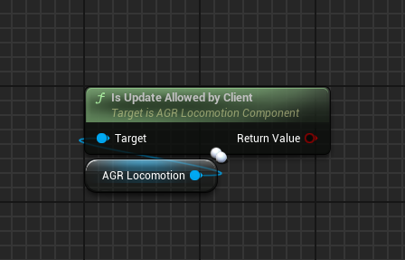

## Get Rotation Method

`Get Rotation Method` gets the rotation method.

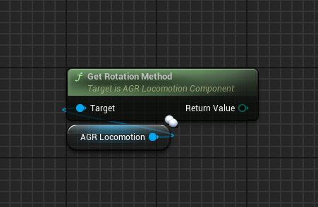

## Set Rotation Method

`Set Rotation Method` sets the rotation method (Network replicated).
* `Rotation Method` <Step text="1"/> : The new rotation method.

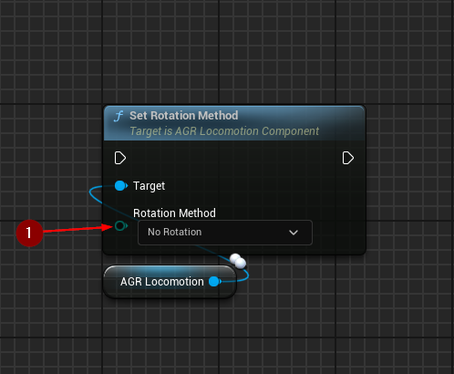

## Get Aim Method

`Get Aim Method` gets the aim method.

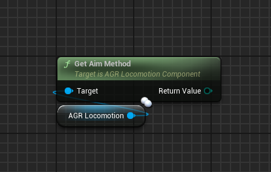

## Set Aim Method

`Set Aim Method` sets the aim method (Network replicated).

* `Ain Method` <Step text="1"/> : The new aim method.

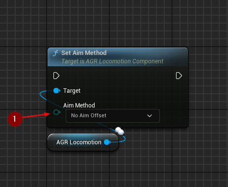

## Get Pose

`Get Pose` gets current pose represented by a tag.

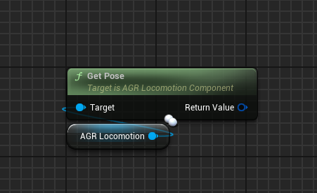

## Set Pose

`Set Pose` sets the pose (Network replicated).
* `Pose` <Step text="1"/> : The new pose.

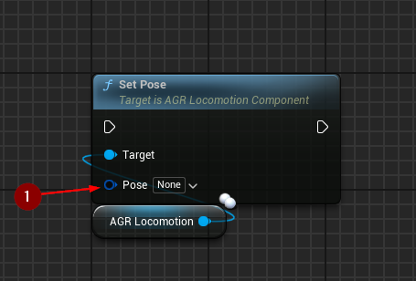

## Get Animation States

`Get Animation States` gets `AnimationStates` gameplay tag container.

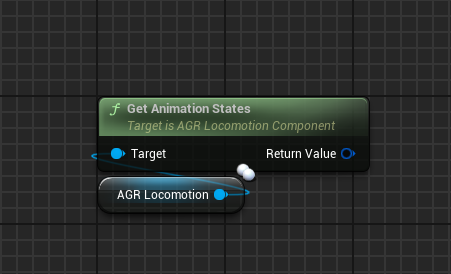

## Set Animation States

`Set Animation States` sets `AnimationStates` (Network replicated).
* `Animation States` <Step text="1"/> : Gameplay tag container to set
`AnimationStates` to.

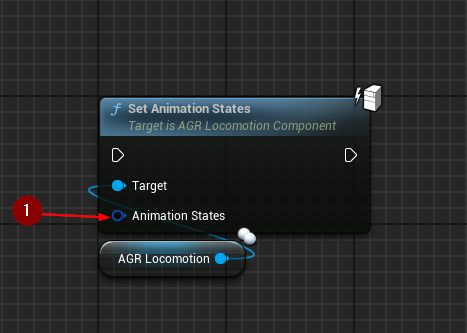

:::note
This function should only be called with authority.
:::

## Add Animation States

`Add Animation States` adds tags to the `AnimationStates` gameplay tag container.
* `Animation States to Add` <Step text="1"/> : Gameplay tag container with tags
to add to `AnimationStates`.

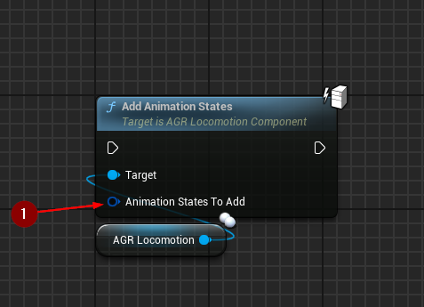

:::note
This function should only be called with authority.
:::

## Remove Animation States

`Remove Animation States` removes tags from the `AnimationStates` gameplay tag
container.
* `Animation States to Remove` <Step text="1"/> : Gameplay tag container with
tags to remove from `AnimationStates`.

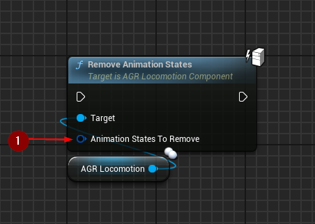

:::note
This function should only be called with authority.
:::