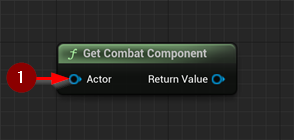

import {Step, Highlight} from '@site/src/lib/utils.mdx'

## Get Combat Component

`Get Combat Component` retrieves the `AGR Combat Component` from
the actor or its instigator.
* `Actor` <Step text="1"/> : Target for retrieval.

Returns the found component, or nullptr.

