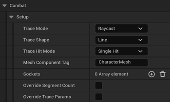
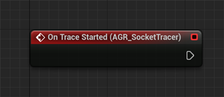
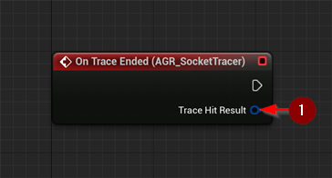
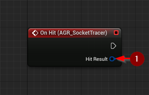
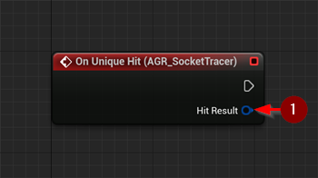

import {Step} from '@site/src/lib/utils.mdx'

The `AGR Socket Tracer Component` detects hits using socket-defined points on a mesh and customizable trace shapes.
This tracer is ideal for weapons or actions where spatial movement is defined by mesh sockets, such as sword swings,
melee punches, or whip-like attacks.

It supports different trace modes, shapes, hit modes, and the ability to override segment count and trace parameters
from the combat component.

## Socket Tracer Settings

### Setup
* `Trace Mode` : Determines how trace points are used during the trace operation.
* `Trace Shape` : Geometric shape used for tracing (e.g., line, sphere, capsule).
* `Trace Hit Mode` : Whether to detect a single hit or multiple hits.
* `Mesh Component Tag` : The tag used to identify the mesh component (e.g., skeletal or static) that provides sockets.
* `Sockets` : List of socket names used to define the trace path. Requires at least two sockets.
* `Override Segment Count` : If true, overrides the segment count from the combat component.
* `Overridden Segment Count` : Custom segment count used for tracing. Only active if override is enabled.
* `Override Trace Params` : If true, overrides the trace parameters from the combat component.
* `Overridden Trace Params` : Custom trace parameters used for hit detection (trace channel, profile, ignored actors, etc.).

:::tip
To ensure accuracy, the first socket in `Sockets` should ideally be at the tip of the weapon (e.g., blade or fist).
:::

:::note
You can override the default segment count and trace parameters from the combat component for this individual tracer.
:::

## Events

### On Trace Started
Triggered when tracing begins.

### On Trace Ended
Triggered when tracing ends.
* `Trace Hit Result` <Step text="1"/> : A wrapper containing all actors and their associated hit results.

### On Hit
Triggered for every hit during tracing.
* `Hit Result` <Step text="1"/> : Data about the actor hit by the tracer.

### On Unique Hit
Triggered only for unique actor hits per trace cycle.
* `Hit Result` <Step text="1"/> : Data about the unique hit.

:::note
A unique hit means the same actor is only counted once during a trace cycle.
:::

