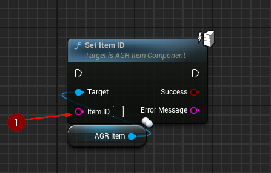
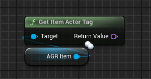

import {Step} from '@site/src/lib/utils.mdx'

## Set Item ID

`Set Item ID` sets new ID for this item.
* `Set Item ID` <Step text="1"/> : New item ID.

:::note
This function should only be called with authority.
:::

## Get Item Actor Tag

`Get Item Actor Tag` gets the item actor tag name that is configured in this
plugin's project settings.

