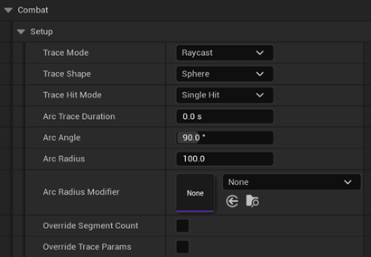
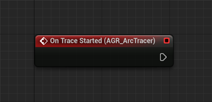
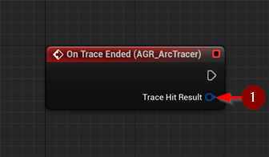
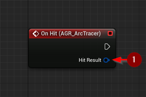
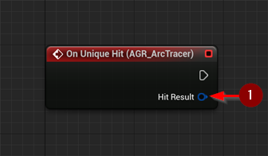

import {Step} from '@site/src/lib/utils.mdx'

The `AGR Arc Tracer Component` detects hits by tracing a custom-shaped arc. It supports dynamic radius shaping via curve
assets, segment control, and time-based tracing over multiple frames. This tracer is ideal for wide-sweeping attacks
such as slashes, shockwaves, radial pulses, or any gameplay element that needs a non-linear hit shape.

## Arc Tracer Settings

### Setup
* `Trace Mode` : Determines how trace points are used during the trace operation.
* `Trace Shape` : Geometric shape used for tracing (e.g., line, sphere, capsule).
* `Trace Hit Mode` : Whether to detect a single hit or multiple hits.
* `Arc Trace Duration` : Duration (in seconds) to perform the trace over time. If set to `0`, the trace will occur instantly in a single frame.
* `Arc Angle` : Total angle (in degrees) of the arc (e.g., 90° for a quarter circle).
* `Arc Radius` : Radius (distance) from the origin to the end of the arc.
* `Arc Radius Modifier` : A curve asset used to dynamically scale the radius per segment. The curve is sampled using segment index. Values below 1.0 are clamped.
* `Override Segment Count` : If true, uses a custom segment count instead of the default from the combat component.
* `Override Trace Params` : If true, allows customizing trace parameters instead of using the default from the combat component.

:::note
You can create complex arc shapes by customizing the `Arc Radius Modifier` curve.
:::

## Events

### On Trace Started
Triggered when tracing begins.

### On Trace Ended
Triggered when tracing ends.
* `Trace Hit Result` <Step text="1"/> : A wrapper containing all actors and their associated hit results.

### On Hit
Triggered for every actor hit during tracing.
* `Hit Result` <Step text="1"/> : Details about the collision.

### On Unique Hit
Triggered only for unique actor hits per trace cycle.
* `Hit Result` <Step text="1"/> : Details about the unique hit.

:::note
A unique hit means the same actor is only counted once during a trace cycle.
:::

