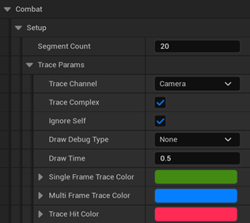
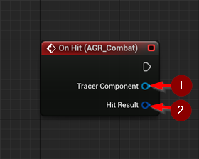
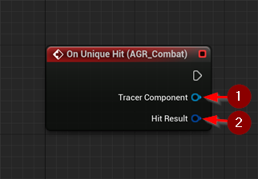
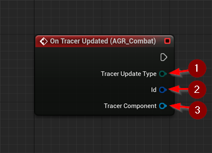

import {Step} from '@site/src/lib/utils.mdx'

The `AGR Combat Component` manages combat gameplay mechanics and handles registering and triggering tracer components.

Tracer components are used to simulate and detect hits or impacts during melee attacks, arcs, or other proximity-based combat logic.

Use the `AGR Trace Anim Notify State` to control when registered tracers should start and end during animations.

## Combat Component Settings

### Setup
* `Segment Count` : Specifies the number of points to be used for tracing by the tracer component. This value determines how many evenly distributed segments will be created along the path.
* `Trace Params` : [Parameters](/docs/combat-module/types#trace-params) for trace operations used by the AGR tracer components.

## Events

### On Hit

`On Hit` is triggered when a tracer component detects a hit.

* `Tracer Component` <Step text="1"/> : Reference to the component that caused the hit.
* `Hit Result` <Step text="2"/> : Details about the hit.

### On Unique Hit

`On Unique Hit` is triggered when a unique hit (one actor per trace cycle) is detected by a tracer.

* `Tracer Component` <Step text="1"/> : Reference to the component that caused the hit.
* `Hit Result` <Step text="2"/> : Details about the unique hit.

:::note
You should implement logic to filter and define what a "unique" hit means for your use case.
:::

### On Tracer Updated

`On Tracer Updated` is triggered when a tracer is registered, unregistered, or has started/ended tracing.

* `Update Type` <Step text="1"/> : Type of update (Registered, Unregistered, Started, Ended)
* `Tracer Id` <Step text="2"/> : Gameplay tag used to identify the tracer.
* `Tracer Component` <Step text="3"/> : Reference to the component.

This component is designed to be extended and integrated with custom tracer implementations, such as sockets, arcs, or line traces.
