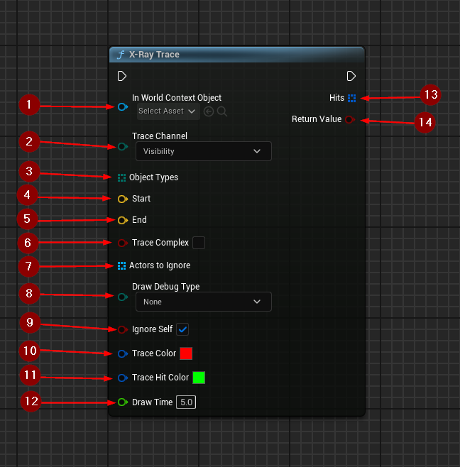

import {Step, Highlight} from '@site/src/lib/utils.mdx'

## X-Ray Trace

`X-Ray Trace` does a collision trace along the given line and returns all hits
encountered.
This only finds objects that are of a type specified by `ObjectTypes` and will
be filtered by `TraceChannel` and will return only blocking collision response.

* `World Context Object` <Step text="1"/> : World context.
* `Trace Channel` <Step text="2"/> : The channel to trace.
* `Object Types` <Step text="3"/> : Array of Object Types to trace. If left
empty, all object types will be selected.
* `Start` <Step text="4"/> : Start of line segment.
* `End` <Step text="5"/> : End of line segment.
* `Trace Complex` <Step text="6"/> : True to test against complex collision,
false to test against simplified collision.
* `Actors to Ignore` <Step text="7"/> : Array of actors that will be ignored
during the line trace.
* `Draw Debug Type` <Step text="8"/> : Draw debug trace type.
* `Ignore Self` <Step text="9"/> : True to ignore self actor.
* `Trace Color` <Step text="10"/> : Trace color.
* `Trace Hit Color` <Step text="11"/> : Trace hit color.
* `Draw Time` <Step text="12"/> : Draw time when type is not none.

Returns <Step text="13"/> properties of the trace hit and true <Step text="14"/>
if there was a blocking hit, false otherwise.