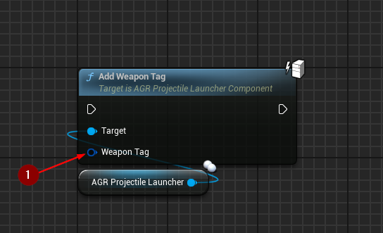
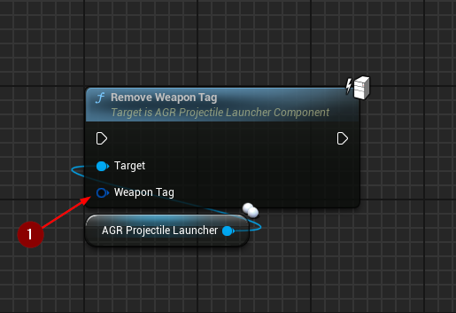

import {Step} from '@site/src/lib/utils.mdx'

## Set Weapon Tags

`Set Weapon Tags` sets `WeaponTags` array.
* `Weapon Tags` <Step text="1"/> : Input array to set.

:::note
This function should only be called with authority.
:::

## Add Weapon Tag

`Add Weapon Tag` adds tag to the `WeaponTags` array.
* `Weapon Tag` <Step text="1"/> : Tag to add to the array.

:::note
This function should only be called with authority.
:::

## Remove Weapon Tag

`Remove Weapon Tag` removes tag from the `WeaponTags` array.
* `Weapon Tag` <Step text="1"/> : Tag to remove from the array.

:::note
This function should only be called with authority.
:::